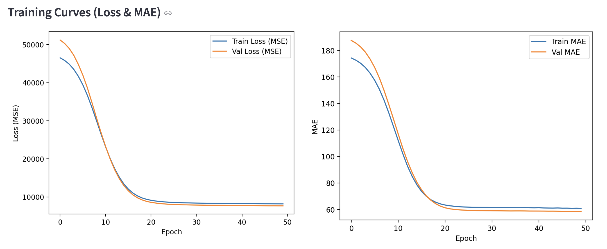
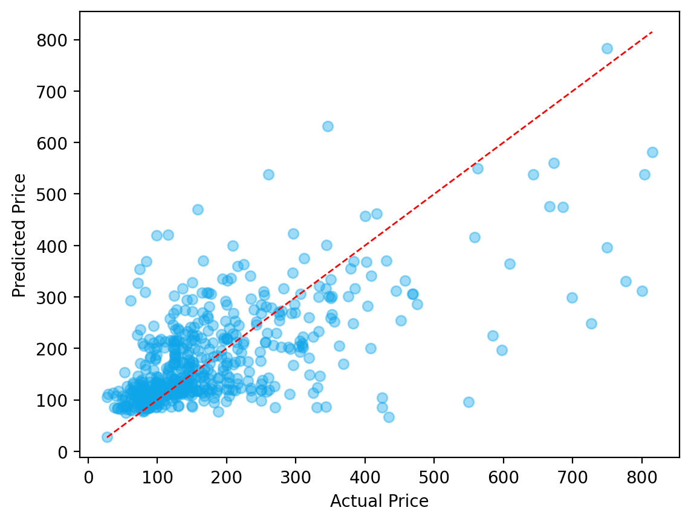

# 🏠 Airbnb Price Prediction — Asheville, NC

### **Overview**
This project builds a complete **machine learning pipeline** to predict Airbnb listing prices in **Asheville, North Carolina**, using real-world data from the **Inside Airbnb** dataset.  
It walks through all stages of the data science process — from cleaning and exploration to neural network modeling — to uncover how factors like location, property type, and host attributes influence nightly pricing.

🔗 [Live Streamlit App](https://airbnb-price-predictions-p4zkawudgdvfefsvnfveae.streamlit.app/#overview)

### **Problem Statement**
Airbnb hosts and analysts often struggle to determine fair and competitive listing prices.  
The objective of this project is to **predict nightly prices** based on listing attributes such as **room type, host behavior, and reviews**, while also identifying the most influential pricing drivers.

### **About the Data**
- **Source**: [Inside Airbnb](http://insideairbnb.com/get-the-data.html) (city export — `listings.csv`)  
- **Focus City**: Asheville, North Carolina  
- **Key Features**:  

| **Numerical** | **Categorical** |
|----------------|----------------|
| `price` | `room_type` |
| `bathrooms` | `host_identity_verified` |
| `bedrooms` | `host_is_superhost` |
| `number_of_reviews` |  |
| `latitude` |  |
| `longitude` |  |

### **Steps Performed**

  

#### **1️⃣ Data Loading**
- Imported `listings.csv` and verified schema and data consistency.  
- Checked dataset shape and previewed top rows for validation.

#### **2️⃣ Data Selection (Asheville, NC)**
- Filtered listings for **Asheville, NC** using city/state fields and geographic bounds.  
- Retained compact numeric and categorical columns for model interpretability.

#### **3️⃣ Data Preprocessing**
- Dropped rows with missing `price` values (target variable).  
- Cleaned numerical columns and converted non-numeric strings.  
- Filled missing `host_is_superhost` using **mode imputation** (most frequent value).  
- Converted `'t'/'f'` → `True/False` and ensured correct data types.  

#### **4️⃣ Exploratory Data Analysis (EDA)**
- **Descriptive Statistics**: Summary of key numeric variables.  
- **Histograms & Pairplots**: Distribution of price, bedrooms, bathrooms, and reviews.  
- **Correlation Heatmap**: Identified strong predictors of price.  
- **Outlier Handling**: Applied 99th percentile rule to cap extreme prices.  
- **Geospatial Map**: Interactive visualization showing pricing clusters across Asheville.  

#### **5️⃣ Modeling (Keras Regression Network)**
- Normalized features and performed **train-test split (80/20)**.  
- Built a Keras Sequential model with:
  - Normalization Layer  
  - 1 Hidden Layer (64 neurons, ReLU activation)  
  - Output Layer for regression (price prediction)
- Trained over 50 epochs with validation split.  
- Evaluated using **MAE**, **RMSE**, and **R²**.

### **Results**

 

| **Metric** | **Value** |
|-------------|--------------------|
| Mean Absolute Error (MAE) | ~64.5 |
| Root Mean Squared Error (RMSE) | ~98.6 |
| R² (Explained Variance) | ~0.41 |

- The model achieved stable convergence, showing consistent training and validation loss curves.  
- Predicted prices align closely with actual values, capturing location and review-driven variations effectively.

### **Business Impact**

✅ Enables **dynamic pricing strategies** for Airbnb hosts.  
✅ Helps identify **undervalued or overvalued properties** based on their features.  
✅ Offers **data-backed insights** for improving property visibility and revenue optimization.  

### **Takeaways**
- **Data quality and missingness handling** critically affect model reliability.  
- **Mode imputation and normalization** provide stability for mixed-type datasets.  
- **Location and reviews** emerged as key price determinants.  
- The workflow can be easily **replicated for any Airbnb city** with minimal code changes.  

### **Tech Stack**
**Python | Pandas | NumPy | Matplotlib | Seaborn | Plotly | TensorFlow (Keras) | Streamlit**

